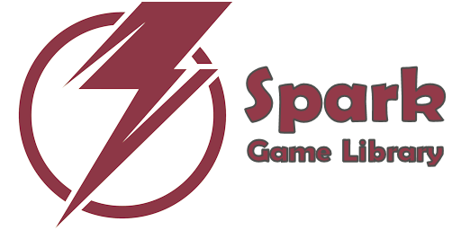

<a href="https://tinybiggames.com" target="_blank"></a>

[](https://discord.gg/tPWjMwK) [](https://twitter.com/tinyBigGAMES)

## Overview
Spark Game Library&trade; is a 2D indie game library that allows you to do game development in <a href="https://www.embarcadero.com/products/delphi" target="_blank">Delphi</a> for desktop PC's running Microsoft Windows® and uses OpenGL® for hardware accelerated rendering.

With Spark, you can get your feet wet, making games and doing it in your favorite programming language, Delphi. You only need to include the `Spark` unit in your project and override a few methods from the `TGame` class. **That is it!** Everything will be included and compiled into your project.

Its robust, designed for easy use and suitable for making all types of 2D games and other graphic simulations, You access the features from a simple and intuitive API, to allow you to rapidly and efficiently develop your projects. There is support for bitmaps, audio samples, streaming music, video playback, loading resources directly from a compressed zip archive, collision detection and much more. Spark, simple and elegant game programming in Delphi. 

## Downloads
<a href="https://github.com/tinyBigGAMES/Spark/archive/refs/heads/main.zip" target="_blank">**Development**</a> - This build represents the most recent development state an as such may or may not be as stable as the official release versions. If you like living on the bleeding edge, it's updated frequently (often daily) and will contain bug fixes and new features.

<a href="https://github.com/tinyBigGAMES/Spark/releases" target="_blank">**Releases**</a> - These are the official release versions and deemed to be the most stable.

## Features
- **Free** for commercial use. See <a href="https://github.com/tinyBigGAMES/Spark/blob/main/LICENSE" target="_blank">License agreement</a>.
- Written in **Object Pascal** with full sources.
- Support Windows 64 bit platform ONLY!
- Hardware accelerated with **OpenGL**
- You interact with the library via an ease to use **API**.
- **Archive** (standard zip format)
- **Window** (OpenGL, anti-aliasing, vsync, viewports, primitives, blending)
- **Input** (keyboard, mouse and joystick)
- **Bitmap** (color key transparency, scaling, rotation, flipped, titled,  BMP, DDS, PCX, TGA, JPEG, PNG)
- **Video** (play, pause, rewind, OGV format)
- **Audio** (samples, streams, WAV, OGG/Vorbis, FLAC formats)
- **Font** (true type, scale, rotate)
- **Timing** (time-based, frame elapsed, frame speed)
- **Misc** (collision, easing, screenshake, screenshot, starfield, colors, INI based config files)

## Minimum System Requirements
- <a href="https://www.embarcadero.com/products/delphi/starter" target="_blank">Delphi Community Edition</a>
- Microsoft Windows 10, 64 bits
- OpenGL 3

## How to use in Delphi
- Unzip the archive to a desired location.
- Add `installdir\sources`, folder to Delphi's library path so Spark source files can be found for any project or for a specific project add to its search path.
- See examples in the `installdir\examples` for more information about usage.
- Compile and the `ZipArc` utility for making **.ZIP** files (standard compressed zip format). Running the `makearc.bat` in `installdir\bin` will build `Data.arc` that is used by the examples.
- Build and run the examples to showcase many of the features and capabilities of the library.
- There are no other dependencies required other than what is used by your own projects such as your **.ZIP** archive files.

## Known Issues
- This project is in active development so changes will be frequent, but should be very stable. 
- More examples will continually be added over time
- More features will continually be added over time

## A Tour of Spark Game Library
### Game Object
You just have to derive a new class from the `TGame` base class and override a few callback methods. You access the library functionality from the `TGame` methods.
```pascal
uses
  Spark;
  
const
  cArchivePassword   = 'a15bef2d07b24a589c3d78d5ba341a94';
  cArchiveFilename   = 'Data.arc';

  cDisplayTitle      = 'MyGame';
  cDisplayWidth      = 800;
  cDisplayHeight     = 480;
  cDisplayFullscreen = False;

type
  { TMyGame }
  TMyGame = class(TGame)
  protected
    FFont: Int64;
  public
    procedure OnStartup; override;
    procedure OnShutdown; override;
    procedure OnUpdateFrame(aDeltaTime: Double); override;
    procedure OnClearFrame; override;
    procedure OnShowFrame; override;
    procedure OnRenderFrame; override;
    procedure OnRenderHUD; override;
  end;
```
### How to use
A minimal implementation example:
```pascal
uses
  System.SysUtils;

{ TMyGame }
procedure TMyGame.OnStartup;
begin
  // open zip archive
  OpenZipArc(cArchivePassword, cArchiveFilename);  

  // open window
  OpenWindow(cDisplayWidth, cDisplayHeight,  cDisplayFullscreen, cDisplayTitle);

  // use default mono spaced font
  FFont := LoadFont(16)
end;

procedure TMyGame.OnShutdown;
begin
  // unload font
  UnloadFont(FFont);

  // close window
  CloseWindow;
  
  // close archive
  CloseZipArc;  
end;

procedure TMyGame.OnUpdateFrame(aDeltaTime: Double);
begin
  // process input
  if KeyboardPressed(KEY_ESCAPE) then
    SetTerminate(True);
end;

procedure TMyGame.OnClearFrame;
begin
  // clear window
  ClearWindow(BLACK);
end;

procedure TMyGame.OnShowFrame;
begin
  // show display
  ShowWindow;
end;

procedure TMyGame.OnRenderFrame;
begin
  // render any graphics here
end;

procedure TMyGame.OnRenderHUD;
var
  Pos: TVector;
begin
  // assign hud start pos
  Pos.Assign(3, 3, 0);

  // display hud text
  PrintText(FFont, Pos.X, Pos.Y, Pos.Z, WHITE, alLeft, 'fps %d', [GetFrameRate]);
  PrintText(FFont, Pos.X, Pos.Y, 0, GREEN, alLeft, 'Esc - Quit', []);
end;
```
To run your game, call
```pascal
RunGame(TMyGame);
```
**NOTE:** For Spark to work properly, execution MUST start with `RunGame(...)`. This call will property setup/shutdown the library and log and handle errors. Only one Spark app instance is allowed to run and will safely terminated if more than one is detected.

See the examples for more information on usage.

## Media


## Support
<table>
<tbody>
	<tr>
		<td>Project Discussions</td>
		<td><a href="https://github.com/tinyBigGAMES/Spark/discussions">https://github.com/tinyBigGAMES/Spark/discussions</a></td>
	</tr>
	<tr>
		<td>Project Tracking</td>
		<td><a href="https://github.com/tinyBigGAMES/Spark/projects">https://github.com/tinyBigGAMES/Spark/projects</a></td>
	</tr>
	<tr>
		<td>Project Wiki</td>
		<td><a href="https://github.com/tinyBigGAMES/Spark/wiki">https://github.com/tinyBigGAMES/Spark/wiki</a></td>
	</tr>		
	<tr>
		<td>Website</td>
		<td><a href="https://tinybiggames.com">https://tinybiggames.com</a></td>
	</tr>
	<tr>
		<td>E-Mail</td>
		<td><a href="mailto:support@tinybiggames.com">support@tinybiggames.com</a></td>
	</tr>
	<tr>
		<td>Discord</td>
		<td><a href="https://discord.gg/tPWjMwK">https://discord.io/tinyBigGAMES</a></td>
	</tr>
	<tr>
		<td>Twitter</td>
		<td><a href="https://twitter.com/tinyBigGAMES">https://twitter.com/tinyBigGAMES</a></td>
	</tr>
	<tr>
		<td>Facebook</td>
		<td><a href="https://facebook.com/tinyBigGAMES">https://facebook.com/tinyBigGAMES</a></td>
	</tr>
	<tr>
		<td>YouTube</td>
		<td><a href="https://youtube.com/tinyBigGAMES">https://vimeo.com/tinyBigGAMES</a></td>
	</tr>
</tbody>
</table>

<p align="center">

</p>
<h5 align="center">

Made with :heart: in Delphi
</h5>


